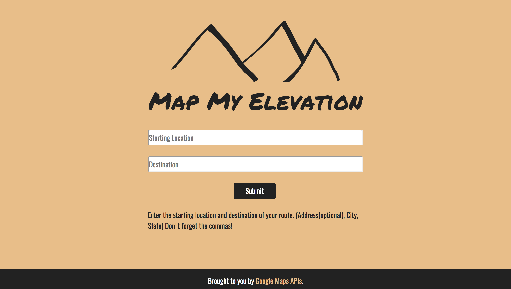

Map My Elevation
==========
This is an app designed to chart your elevation by making api calls to https://developers.google.com/maps.

Summary
-------
Users may type in a starting and finishing location, and then recieve an elevation chart of the shortest route between those two points.   

Live Site
---------
Map My Elevation can be accessed at http://doonyby.github.io/Map-my-elevation/

Features
--------
|  |
|:---:|
| Map My Elevation |

After puting in a starting and finishing location, Map My Elevation makes two async calls to get the route data, and then an elevation chart for that route.  Results are displayed below the form when submitted. 

Technology
----------

### Front End
- HTML5
- CSS3
- [Bootstrap](https://getbootstrap.com/)
- [JQuery](https://jquery.com/)
- [Google Maps API](https://developers.google.com/maps)

